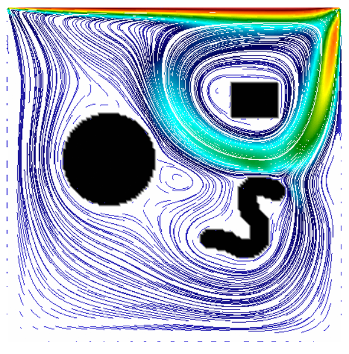

# Lattice-Boltzmann lid driven cavity



A Lattice-Boltzmann method code to simulate the two-dimensional flow in a lid driven cavity. Obstacles in the cavity can be easily inserted with image data.

Submitted with [Metadelee](https://github.com/Metadelee), [brendelmeister](https://github.com/brendelmeister) and [HugoMichi](https://github.com/HugoMichi)
for the summer '14 SiWiR2 class at FAU.

### Requirements:
* [NetPBM library](http://netpbm.sourceforge.net/)
* OpenMP for improved performance

### Usage
Compile the code with the provided Makefile.

The parameter file works as follows
```sizex <horizontal domain size, overridden by pgm-geometry>
  sizey <vertical domain size, overridden by pgm-geometry>
  timesteps <number timesteps to simulate>
  omega <omega parameters for SRT LBM>
  vtk_file <name of output files, *.vtk is appended>
  vtk_step <timestep spacing between output files>
  geometry <file name of a black/white pgm-graphic to generate flow obstacles (black). Uncomment with '#' if not needed>```

Then run
```./lbm params.dat```
to simulate the defined flow and generate VTK output. Upon completion of the simulation, the code outputs the Mega-Lattice-Updates/second (a performance measure).
The output files can be visualized e.g. with
[ParaView](http://www.paraview.org/) or [VisIt](ftp://ftp.llnl.gov/pub/visit)
